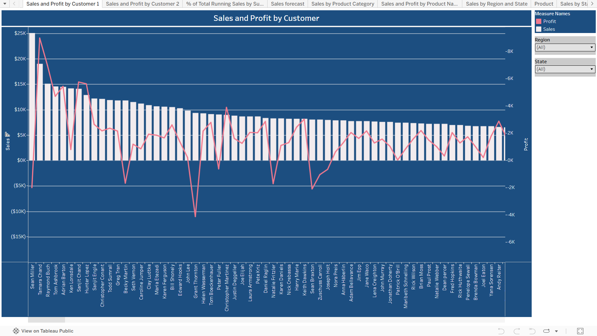
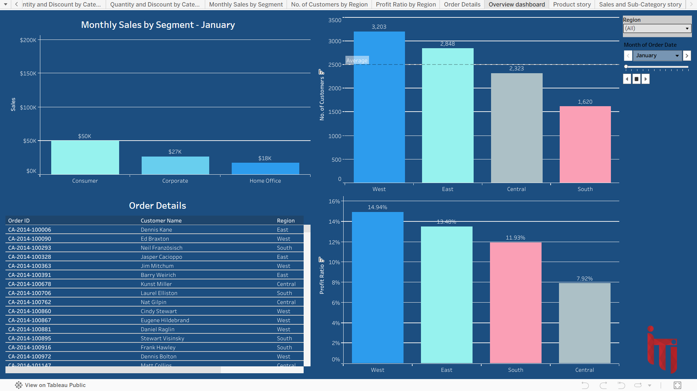
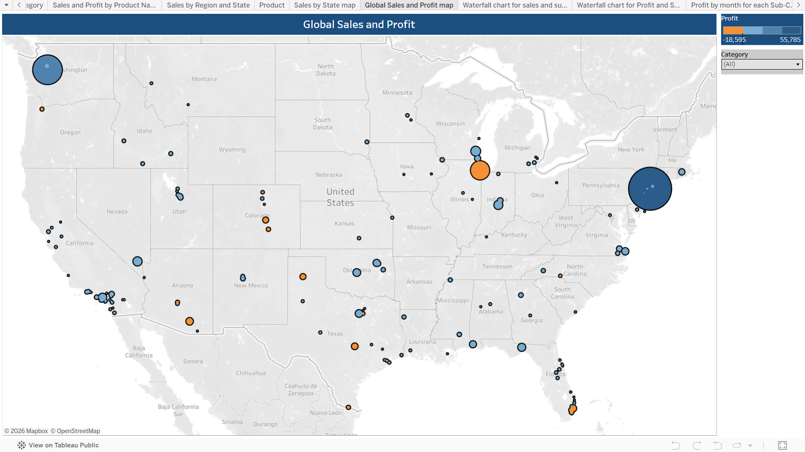

# Superstore Sales & Profit Tableau Dashboard 📊

> An end-to-end business intelligence dashboard built on the Superstore dataset, designed to turn raw transactional data into clear, actionable decisions for sales, profit, and customer performance.

---

## 📌 Overview

This dashboard was built to answer one core business question: **where is the money coming from, and where is it being lost?**

Using Tableau, I explored over 4 years of Superstore sales data across customers, products, categories, regions, and time. The result is a multi-page interactive dashboard that gives business stakeholders a 360-degree view of performance, from high-level overviews down to individual order details.

---

## 🖼️ Dashboard Preview

### Sales and Profit by Customer

### Overview Dashboard

### Global Sales and Profit Map

---

## 📋 Dashboard Pages

| Page | Description |
|------|-------------|
| Sales and Profit by Customer 1 | Bar and line combo showing sales vs. profit per customer |
| Sales and Profit by Customer 2 | Sales indicator table with region filter |
| % of Total Running Sales by Sub-Category | Pareto chart for sub-category contribution |
| Sales Forecast | Year-over-year % difference in monthly sales |
| Sales by Product Category | Category-level sales comparison |
| Sales and Profit by Product Name | Granular product-level profitability table |
| Sales by Region and State | Regional sales breakdown with state-level detail |
| Sales by State Map | Geographic heatmap of sales across US states |
| Global Sales and Profit Map | Bubble map showing profit vs. loss by location |
| Waterfall Chart - Sales | Running sum of sales by sub-category |
| Waterfall Chart - Profit | Running sum of profit by sub-category |
| Profit by Month for each Sub-Category | Monthly profit trends with year and sub-category filters |
| Sales by Category (Lollipop Chart) | Visual category comparison using lollipop design |
| Quantity and Discount by Category | Pie and bar analysis of quantity vs. discount |
| Monthly Sales by Segment | Consumer, Corporate, and Home Office monthly breakdown |
| No. of Customers by Region | Customer distribution across 4 US regions |
| Profit Ratio by Region | Profit efficiency comparison across regions |
| Order Details | Granular order-level data table |
| Overview Dashboard | Combined multi-chart summary view |
| Product Story | Product-focused narrative combining region, category, and product views |
| Sales and Sub-Category Story | Waterfall-based story on sub-category sales progression |

---

## 🔍 Key Insights

- **Technology** leads in sales at **$836K**, followed by Furniture at **$742K** and Office Supplies at **$719K**
- **West region** has the highest sales at **$725K** and the best profit ratio at **14.94%**
- **Central region** has the lowest profit ratio at **7.92%**, signaling potential discount or cost issues
- **Office Supplies** dominates in quantity with **22,906 units** sold out of 37,873 total
- Several customers show **negative profit** despite high sales volume, highlighting discount impact

---

## 🛠️ Tools and Techniques

| Tool | Usage |
|------|-------|
| **Tableau Desktop** | Dashboard design and development |
| **Tableau Public** | Live deployment and sharing |
| **Superstore Dataset** | 4 years of US retail transactional data |

**Chart types used:** Bar charts, Line charts, Waterfall charts, Lollipop charts, Pie charts, Geographic maps, Bubble maps, Combo charts, Tables, Story points

---

## 🔗 Live Dashboard

Explore the full interactive dashboard on Tableau Public:

